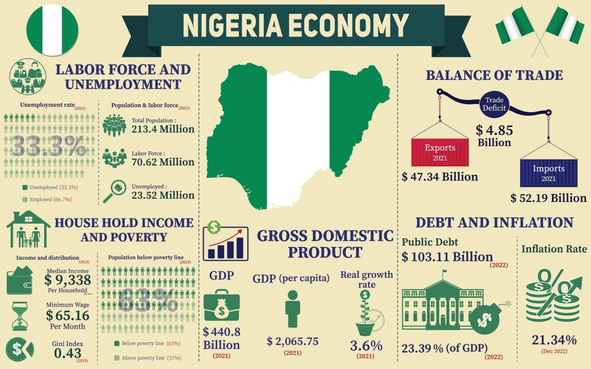
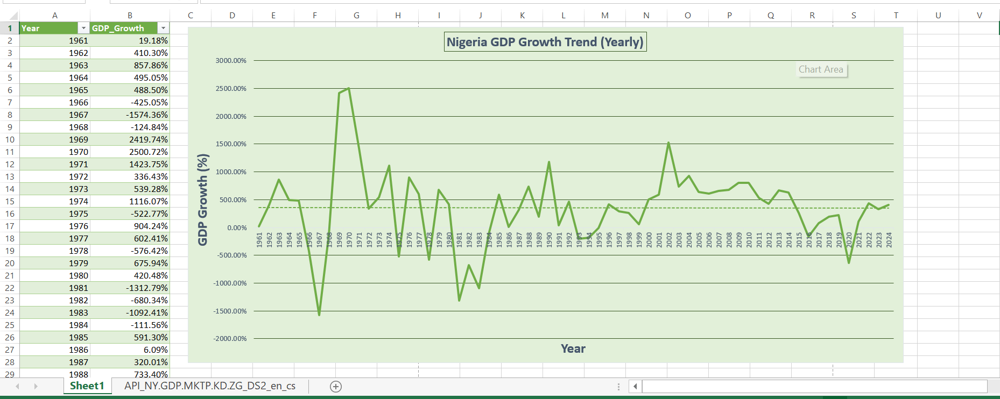
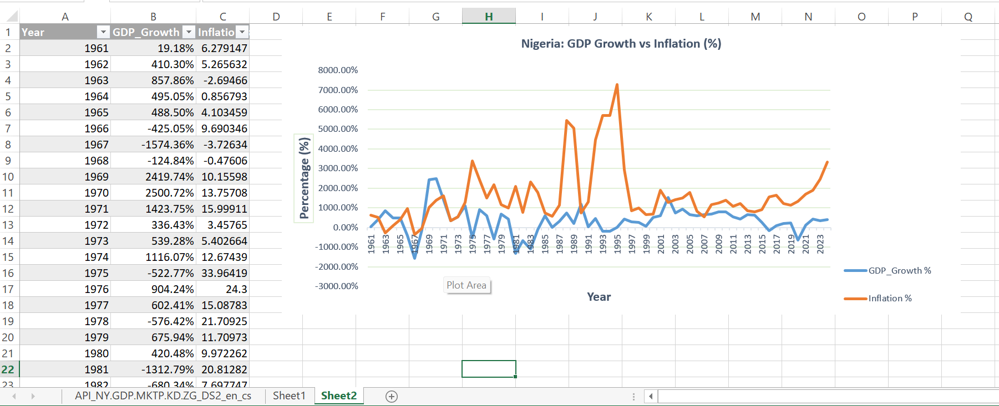
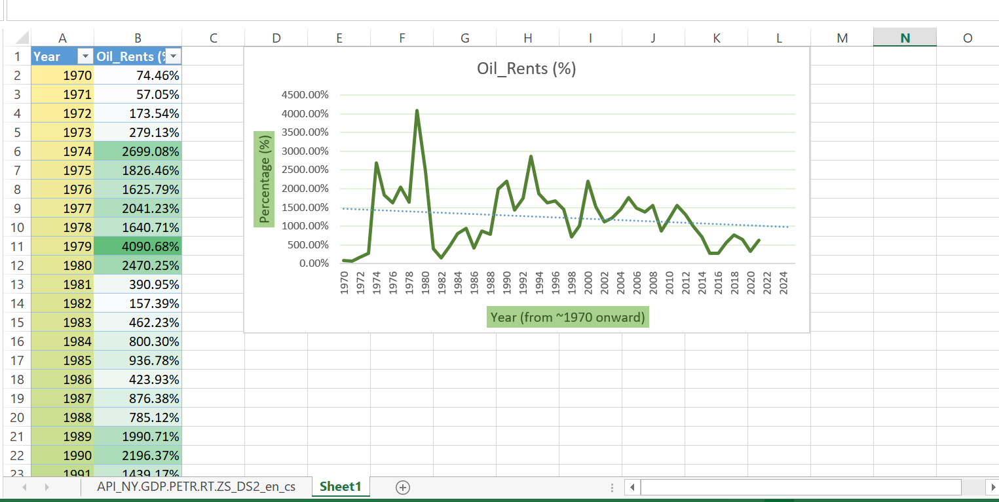
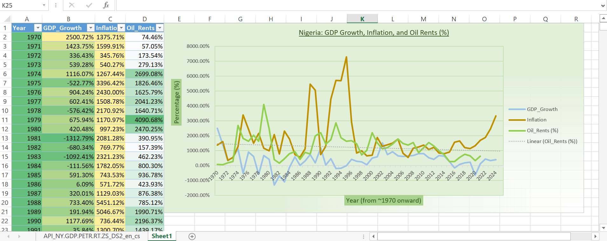
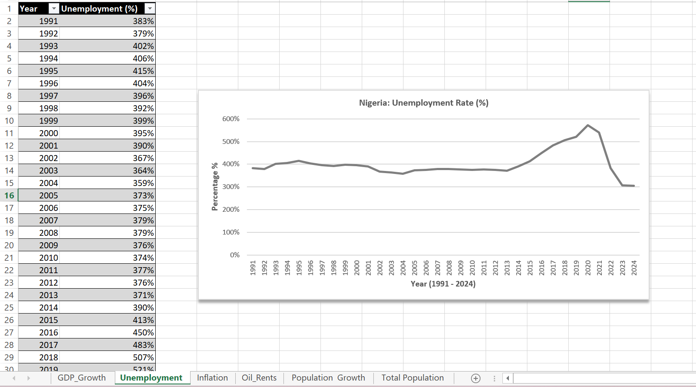
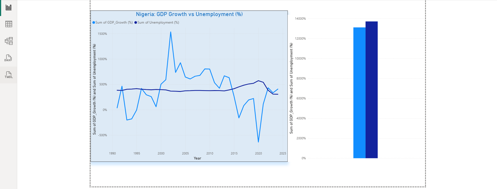
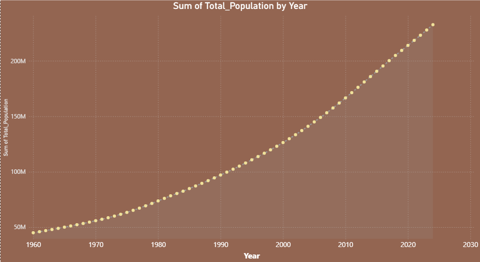

# Nigeria Macroeconomic Data Analysis

## Project Overview

This project presents a structured macroeconomic analysis of Nigeria using key economic indicators, including GDP growth, inflation, oil rents, unemployment, and population data. 

The study applies data cleaning, transformation, and visualization techniques to examine trends, volatility, and relationships among these indicators over time.

---

## Objectives

The objectives of this project are to:

1. Examine the long-term trend and volatility of Nigeria’s GDP growth.
2. Analyze inflation patterns and assess price stability.
3. Investigate the relationship between GDP growth and inflation.
4. Evaluate the impact of oil rents on economic performance.
5. Assess unemployment trends and their relationship with economic growth.
6. Analyze population growth and its implications for development.
7. Explore interconnections among all selected macroeconomic indicators.

---

## Methodology

The analysis followed a structured data processing approach:

1. Data was obtained from the World Bank Open Data platform.
2. Relevant indicators were selected: GDP growth, inflation, oil rents, unemployment, and population.
3. The dataset was filtered to focus on Nigeria.
4. Data was transformed into time-series format (Year as rows).
5. Missing and incomplete values were cleaned and standardized.
6. Descriptive analysis was performed using Excel.
7. Line charts were created to visualize trends and fluctuations.

---

## Data Source

- World Bank Open Data

---

## Tools Used

- Microsoft Excel (Data Cleaning, Transformation, Analysis)
- Excel Charts (Visualization)
- Power BI (Dashboard)

---

## Analysis

### 1. GDP Growth Trend Analysis
Examines long-term economic performance, including periods of expansion and contraction.

### 2. Inflation Trend Analysis
Assesses price stability and identifies inflation volatility over time.

### 3. Oil Rents Analysis
Evaluates the contribution of oil revenue to the economy and its potential influence on growth.

### 4. Unemployment Analysis
Examines labor market trends and their economic implications.

### 5. Population Growth Analysis
Analyzes demographic changes and their impact on economic development.

### 6. Comparative Analysis
Explores relationships among GDP growth, inflation, oil rents, unemployment, and population.

---

## Visualization

### 1. GDP Growth Trend Analysis

---

## Key Insights

- Nigeria’s GDP growth exhibits significant fluctuations over time.
- Periods of negative growth indicate economic contraction.
- The economy demonstrates volatility, possibly influenced by external factors such as oil price dynamics and global economic conditions.

---

## Conclusion

The analysis highlights structural volatility in Nigeria’s macroeconomic performance and establishes a foundation for further multi-variable economic evaluation.

### 2. Inflation Trend Analysis 
Assesses price stability, and to identifies inflation volatility over time.
## Analysis → Comparative Analysis

---
### GDP Growth and Inflation Relationship Insight

- The comparative analysis between GDP growth and inflation reveals a generally inverse and unstable relationship over time.
- There are periods of high inflation often coincide with reduced or negative GDP growth, indicating potential macroeconomic pressure on economic expansion.
- The presence of sharp fluctuations in both indicators suggests that Nigeria’s economy experiences volatility, where price instability may contribute to uncertain growth performance.
- While the relationship is not perfectly consistent across all years, the overall pattern indicates that inflationary pressures can have a dampening effect on economic growth.

These observations highlight the importance of maintaining price stability to support sustainable economic development.

### 3. Oil Rents Analysis
To evaluates the contribution of oil revenue to the economy and its potential influence on growth.

## Visualization

### Oil Rents Trend

### GDP, Inflation, and Oil Rents Comparison

### Oil Rents Trend Analysis

- I discovered that Nigeria’s oil rents also exhibit significant fluctuations over time, reflecting periods of high dependence on oil revenue followed by notable declines.
- These variations suggest strong sensitivity to global oil price movements and changes in production levels.
- And, the pattern highlights the economy’s reliance on the oil sector, where periods of increased oil rents correspond to higher contributions of oil to national income.
- However, the observed volatility indicates vulnerability to external shocks, reinforcing the need for economic diversification.

  ### Comparative Economic Analysis

- The combined analysis of GDP growth, inflation, and oil rents reveals a complex and volatile macroeconomic relationship. Periods of high oil rents often align with improved economic performance, suggesting that oil revenue plays a significant role in driving growth.
- However, fluctuations in inflation and oil rents contribute to instability in GDP growth, indicating that the economy is sensitive to both internal price pressures and external resource dependency.
- While oil revenue can support economic expansion, volatility in both inflation and oil rents creates uncertainty in sustained growth.
- Overall, the findings suggest that Nigeria’s economic performance is influenced by a combination of oil sector dynamics and macroeconomic stability, highlighting the importance of diversification and effective economic management.

### 4. Unemployment Trend Analysis

- Nigeria’s unemployment rate exhibits high noticeable fluctuations over time, reflecting instability in the labor market.
- While the trend shows periods of moderate change, a significant increase is observed around 2020, indicating a sharp rise in unemployment levels.
- This spike suggests the presence of external or structural shocks affecting employment conditions during that period. Overall, the pattern highlights underlying challenges in job creation and economic absorption capacity, pointing to the need for sustained employment-focused economic strategies.

  ### GDP Growth vs Unemployment 
  
  
  ### Insight
- The comparative analysis of Nigeria’s GDP growth and unemployment rate reveals a clear relationship between economic performance and labor market conditions.
- Periods of declining GDP growth are often accompanied by rising unemployment, indicating that slower economic expansion directly affects job creation.
- The sharp spike in unemployment around 2020 coincides with a period of negative GDP growth, highlighting how economic contractions can exacerbate labor market challenges.
- Overall, this analysis emphasizes the importance of policies that stimulate growth while simultaneously supporting employment, as these two indicators are closely intertwined.

### 5. Population Growth Trend

- Nigeria’s population has been increasing consistently over the years without any decline.
- This shows that the country is experiencing continuous population growth.
- This trend means that while there is a growing workforce and market size, it also puts pressure on employment opportunities, infrastructure, and economic resources.
- It highlights the need for the economy to grow at a pace that can support the rising population.
